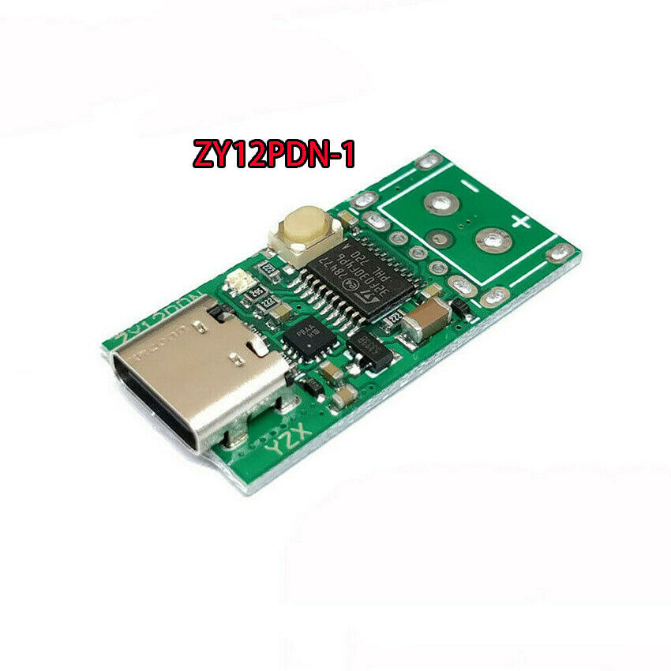
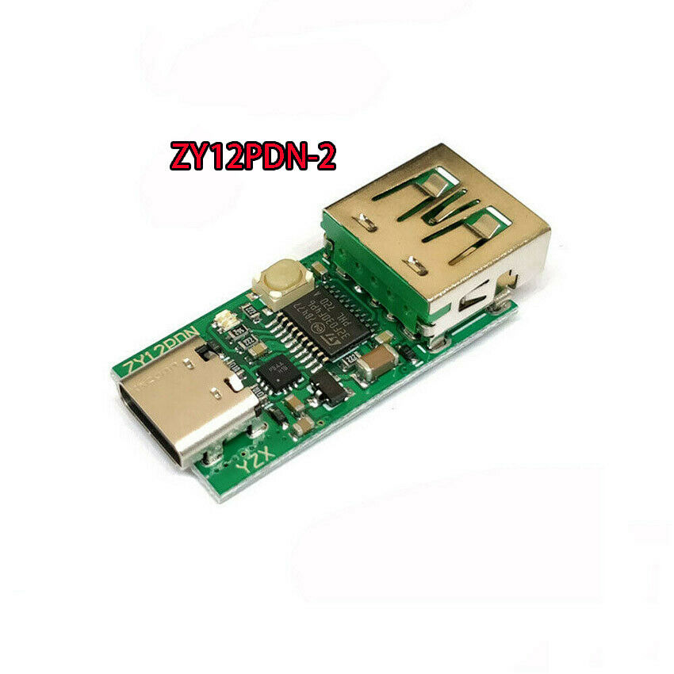
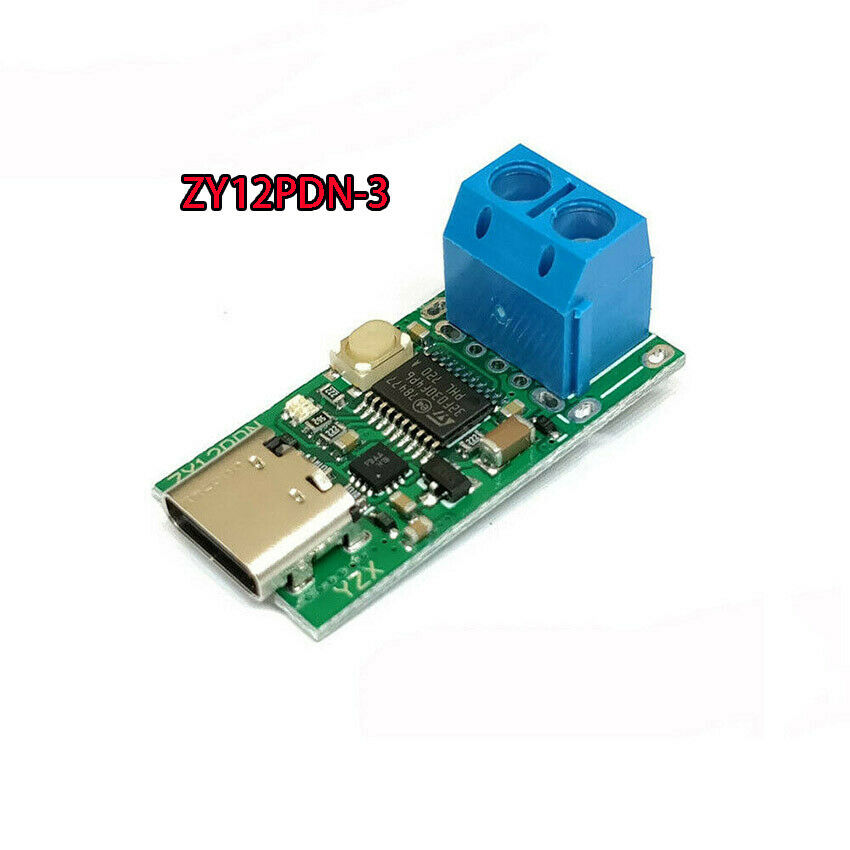
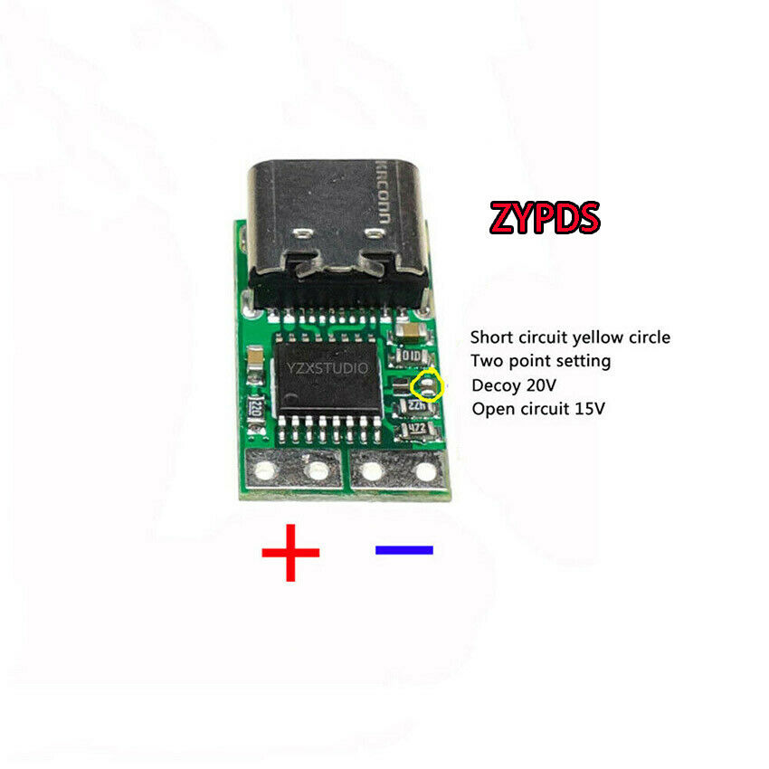

# Some notes on USB-PD triggers

I haven't been able to find good, detailed info about these USB-PD triggers, so I figured I'd document my findings here to save you some trouble!

GreatScott's video: https://www.youtube.com/watch?v=OwAZqJ4wpJg

eBay listing I purchased from: https://www.ebay.com/itm/333247140116

## ZY12PDN, ZY12PDN-1, ZY12PDN-2, ZY12PDN-3

These usually cost a bit more (starting around $8 USD) but are the most customizeable.  It claims to be able to supply 5A. There is a button and RGB LED which helps you determine the selected output voltage. They come in some variations with: nothing, USB-A port (female), 5.0mm screw terminal.

Print on the main IC: `ST e4 78447 32F030F4P6 PHL 812 A`

### Changing the default voltage

Press and hold the button as you insert your USB-PD compatible USB-C cable. The RGB LEDs should flash quickly. Release the button. You are now selecting the default operating mode of this circuit. Pressing the button will move to the next default mode. Holding the button will turn off the LED and select the current mode as the default.

* Red: 5V is selected by default. **Clicking the button will cycle the output voltage through all available voltage options.**
* Yellow: 9V is selected by default. 9V will be the first voltage you recieve across the output, assuming your USB-PD source supports this voltage. Clicking the button does not change the output voltage. **Warning:** If you plug in a USB-PD source that does not offer 9V, it appears to default back to 5V.
* Green: 12V is selected by default. 12V will be the first voltage you recieve across the output, assuming your USB-PD source supports this voltage. Clicking the button does not change the output voltage. **Warning:** If you plug in a USB-PD source that does not offer 12V, it appears to default back to 5V.
* Light Blue: 15V is selected by default. 15V will be the first voltage you recieve across the output, assuming your USB-PD source supports this voltage. Clicking the button does not change the output voltage. **Warning:** If you plug in a USB-PD source that does not offer 15V, it appears to default back to 5V.
* Dark Blue: 20V is selected by default. 20V will be the first voltage you recieve across the output, assuming your USB-PD source supports this voltage. Clicking the button does not change the output voltage. **Warning:** If you plug in a USB-PD source that does not offer 20V, it appears to default back to 5V.
* Purple: Highest available voltage is selected by default. Clicking the button does not change the output voltage.
* White: Demo mode - Automatically cycle through all available voltages, starting with 5V and increasing. Changes roughly once per second.

After you have made your selection for the default operating mode, unplug and replug your USB-C cable to confirm the expected behavior/color.

If you plug it into a non USB-PD 5V power source, the LED will flash blue after ~4 seconds to warn you there is no USB-PD support. It appears to still pass through the 5V power normally.

## ZYPDS

This is the cheapest option ($2.50 USD), but offers very limited customization. It claims to be able to supply 5A.

Print on the IC: `IP2721 PP27 30A`

It appears to support all the voltage options for USB-PD: 5V, 9V, 12V, 15V, and 20V. It will always select the highest voltage possible from the PD source.

As indicated in the photo above, there is a small pad you can bridge with solder to restrict the maximum voltage it outputs. By default, mine defaults to 20V with no solder bridge.  So I believe if you bridge those yellow circled pads, you can restrict the output voltage to 15V. The only way to get 12V, 9V, 5V is by using a USB-PD power source that can only provide those voltage configurations.

The 4 holes on the output side are 0.1" spaced and breadboard-compatible.

It appears to still pass through the 5V power normally, if you plug it into a non USB-PD 5V power source.

## ZY12PDG

I have not tested this board.
